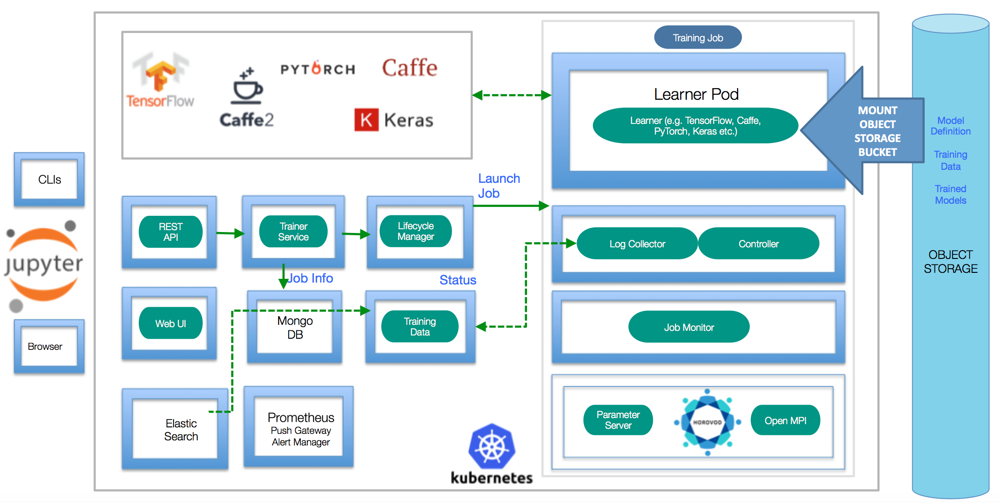

***

<h1 align="center">
:tent: Awesome AI Infrastructures :tent:
</h1>

:orange_book: List of AI infrastructures (a.k.a., machine learning systems, pipelines, and platforms) for machine/deep learning training and/or inference in production :electric_plug:. Feel free to contribute / star / fork / pull request. Any recommendations and suggestions are welcome :tada:.

***

# Introduction

This list contains some popular actively-maintained AI infrastructures that focus on one or more of the following topics:

- Architecture of **end-to-end** machine learning **pipelines**
- **Deployment** at scale in production on Cloud :cloud: or on end devices :iphone:
- Novel ideas of efficient large-scale distributed **training**

in **no specific order**. This list cares more about overall architectures of AI solutions in production instead of individual machine/deep learning training or inference frameworks.

# End-to-End Machine Learning Platforms

### [TFX](https://www.tensorflow.org/tfx/) - TensorFlow Extended ([Google](https://www.google.com/about/))

> TensorFlow Extended (TFX) is a [TensorFlow](https://www.tensorflow.org/)-based general-purpose machine learning platform implemented at Google.

| [__homepage__](https://www.tensorflow.org/tfx/) | [__talk__](https://www.youtube.com/watch?v=vdG7uKQ2eKk) | [__paper__](https://dl.acm.org/citation.cfm?id=3098021) |

#### Architecture:

#### Components:

- **TensorFlow Data Validation**: a library for exploring and validating machine learning data.

- **TensorFlow Transformation**: perform full-pass analyze phases over data to create transformation graphs that are consistently applied during training and serving.

- **TensorFlow Model Analysis**: libraries and visualization components to compute full-pass and sliced model metrics over large datasets, and analyze them in a notebook.

- **TensorFlow Serving**: a flexible, high-performance serving system for machine learning models, designed for production environments

### [KubeFlow](https://www.kubeflow.org/) - The Machine Learning Toolkit for [Kubernetes](https://kubernetes.io/) ([Google](https://www.google.com/about/))

> The Kubeflow project is dedicated to making deployments of machine learning (ML) workflows on [Kubernetes](https://kubernetes.io/) simple, portable and scalable. Our goal is not to recreate other services, but to provide a straightforward way to deploy best-of-breed open-source systems for ML to diverse infrastructures. Anywhere you are running [Kubernetes](https://kubernetes.io/), you should be able to run Kubeflow.

> Kubeflow started as an open sourcing of the way Google ran [TensorFlow](https://www.tensorflow.org/) internally, based on a pipeline called TensorFlow Extended.

| [__homepage__](https://www.kubeflow.org/) | [__github__](https://github.com/kubeflow/kubeflow) | [__documentation__](https://www.kubeflow.org/docs/about/kubeflow/) |
[__blog__](https://kubernetes.io/blog/2017/12/introducing-kubeflow-composable/) |
[__talk__](https://conferences.oreilly.com/strata/strata-ny-2018/public/schedule/detail/69041) | [__slices__](https://cdn.oreillystatic.com/en/assets/1/event/278/Kubeflow%20explained_%20Portable%20machine%20learning%20on%20Kubernetes%20Presentation.pdf) |

#### Components:

- **Notebooks**: a JupyterHub to create and manage interactive Jupyter notebooks.

- **TensorFlow Model Training**: a TensorFlow Training Controller that can be configured to use either CPUs or GPUs and be dynamically adjusted to the size of a cluster with a single setting.

- **Model Serving**: a TensorFlow Serving container to export trained TensorFlow models to [Kubernetes](https://kubernetes.io/). Integrated with Seldon Core, an open source platform for deploying machine learning models on [Kubernetes](https://kubernetes.io/), and NVIDIA TensorRT Inference Server for maximized GPU utilization when deploying ML/DL models at scale.

- **Multi-Framework**: includes [TensorFlow](https://www.tensorflow.org/), [PyTorch](https://pytorch.org/), [MXNet](https://mxnet.apache.org/), [Chainer](https://chainer.org/), and more.

### Michelangelo - Uber's Machine Learning Platform ([Uber](https://www.uber.com/))

> Michelangelo, an internal ML-as-a-service platform that democratizes machine learning and makes scaling AI to meet the needs of business as easy as requesting a ride.

> Michelangelo consists of a mix of open source systems and components built in-house. The primary open sourced components used are [HDFS](https://hortonworks.com/apache/hdfs/), [Spark](https://spark.apache.org/), [Samza](http://samza.apache.org/), [Cassandra](http://cassandra.apache.org/), [MLLib](https://spark.apache.org/mllib/), [XGBoost](https://github.com/dmlc/xgboost), and [TensorFlow](https://www.tensorflow.org/).

| [__blog__](https://eng.uber.com/michelangelo/) | [__use-cases__](https://eng.uber.com/scaling-michelangelo/) |

#### Architecture:

#### Components:

- Manage data
- Train models
- Evaluate models
- Deploy models
- Make predictions
- Monitor predictions

### RAPIDS - Open GPU Data Science ([NVIDIA](https://www.nvidia.com/en-us/))

> The RAPIDS suite of open source software libraries gives you the freedom to execute end-to-end data science and analytics pipelines entirely on GPUs. It relies on NVIDIA® CUDA® primitives for low-level compute optimization, but exposes that GPU parallelism and high-bandwidth memory speed through user-friendly Python interfaces.

> RAPIDS is the result of contributions from the machine learning community and [GPU Open Analytics Initiative (GOAI)](http://gpuopenanalytics.com/) partners, such as [Anaconda](https://www.anaconda.com/), [BlazingDB](https://blazingdb.com/), [__Gunrock__](https://github.com/gunrock/gunrock), etc.

| [__homepage__](https://rapids.ai/) | [__blog__](https://medium.com/rapids-ai) | [__github__](https://github.com/RAPIDSai) |

#### Architecture:

#### Components:

- **[Apache Arrow](https://arrow.apache.org/)**: a columnar, in-memory data structure that delivers efficient and fast data interchange with flexibility to support complex data models.

- **cuDF**: a DataFrame manipulation library based on [Apache Arrow](https://arrow.apache.org/) that accelerates loading, filtering, and manipulation of data for model training data preparation. The Python bindings of the core-accelerated CUDA DataFrame manipulation primitives mirror the pandas interface for seamless onboarding of pandas users.

- **cuML**: a collection of GPU-accelerated machine learning libraries that will provide GPU versions of all machine learning algorithms available in [scikit-learn](https://scikit-learn.org/).

- **cuGRAPH**: a framework and collection of graph analytics libraries that seamlessly integrate into the RAPIDS data science platform.

- **Deep Learning Libraries**: data stored in [Apache Arrow](https://arrow.apache.org/) can be seamlessly pushed to deep learning frameworks that accept array_interface such as [PyTorch](https://pytorch.org/) and [Chainer](https://chainer.org/).

- **Visualization Libraries**: RAPIDS will include tightly integrated data visualization libraries based on [Apache Arrow](https://arrow.apache.org/). Native GPU in-memory data format provides high-performance, high-FPS data visualization, even with very large datasets.

### FBLearner ([Facebook](https://www.facebook.com/))

> FBLearner Flow is capable of easily reusing algorithms in different products, scaling to run thousands of simultaneous custom experiments, and managing experiments with ease.

| [__blog__](https://code.fb.com/core-data/introducing-fblearner-flow-facebook-s-ai-backbone/) | [__slices__](https://www.matroid.com/scaledml/2018/yangqing.pdf) | [__talk__](https://atscaleconference.com/videos/machine-learning-at-scale-fblearner-flow/) |

#### Architecture:

#### Components:

- Experimentation Management UI
- Launching Workflows
- Visualizing and Comparing Outputs
- Managing Experiments
- Machine Learning Library

### Alchemist ([Apple](https://www.apple.com/))

> Alchemist - an internal service built at Apple from the ground
up for easy, fast, and scalable distributed training.

| [__paper__](https://arxiv.org/abs/1811.00143) |

#### Architecture:

#### Components:

- **UI Layer**: command line interface (CLI) and a web UI.

- **API Layer**: exposes services to users, which
allows them to upload and browse the code assets, submit distributed jobs, and query the logs and metrics.

- **Compute Layer**: contains the compute-intensive workloads; in particular, the training and evaluation tasks orchestrated by the job scheduler.

- **Storage Layer**: contains the distributed file systems and object storage systems that maintain the training and evaluation datasets, the trained model artifacts, and the code assets.

### FfDL - Fabric for Deep Learning ([IBM](https://www.ibm.com/))

> Deep learning frameworks such as [TensorFlow](https://www.tensorflow.org/), [PyTorch](https://pytorch.org/), Caffe, Torch, Theano, and MXNet have contributed to the popularity of deep learning by reducing the effort and skills needed to design, train, and use deep learning models. Fabric for Deep Learning (FfDL, pronounced “fiddle”) provides a consistent way to run these deep-learning frameworks as a service on **[Kubernetes](https://kubernetes.io/)**.

| [__blog__](https://developer.ibm.com/code/open/projects/fabric-for-deep-learning-ffdl/) | [__github__](https://github.com/IBM/FfDL) |

#### Architecture:

#### Components:

- **REST API**: the REST API microservice handles REST-level HTTP requests and acts as proxy to the lower-level gRPC Trainer service.

- **Trainer**: the Trainer service admits training job requests, persisting metadata and model input configuration in a database (MongoDB).

- **Lifecycle Manager and learner pods**: The Lifecycle Manager (LCM) deploys training jobs arriving from the Trainer, halting (pausing) and terminating training jobs. LCM uses the [Kubernetes](https://kubernetes.io/) cluster manager to deploy containerized training jobs.

- **Training Data Service**: The Training Data Service (TDS) provides short-lived storage and retrieval for logs and evaluation data from a Deep Learning training job.

### BigDL - Distributed Deep Learning Library for Apache Spark ([Intel](https://www.intel.com/content/www/us/en/homepage.html))

> BigDL is a distributed deep learning library for **Apache Spark**; with BigDL, users can write their deep learning applications as standard Spark programs, which can directly run on top of existing Spark or Hadoop clusters. To makes it easy to build Spark and BigDL applications, a high level [Analytics Zoo](https://github.com/intel-analytics/analytics-zoo) is provided for end-to-end analytics + AI pipelines.

 | [__blog__](https://software.intel.com/en-us/articles/bigdl-distributed-deep-learning-on-apache-spark) | [__code__](https://github.com/intel-analytics/BigDL) |

#### Architecture:

#### Components:

- **Rich deep learning support**. Modeled after Torch, BigDL provides comprehensive support for deep learning, including numeric computing (via Tensor) and high level neural networks; in addition, users can load pre-trained Caffe or Torch models into Spark programs using BigDL.

- **Extremely high performance**. To achieve high performance, BigDL uses Intel MKL and multi-threaded programming in each Spark task. Consequently, it is orders of magnitude faster than out-of-box open source Caffe, Torch or [TensorFlow](https://www.tensorflow.org/) on a single-node Xeon (i.e., comparable with mainstream GPU).

- **Efficiently scale-out**. BigDL can efficiently scale out to perform data analytics at "Big Data scale", by leveraging Apache Spark (a lightning fast distributed data processing framework), as well as efficient implementations of synchronous SGD and all-reduce communications on Spark.

### SageMaker ([Amazon Web Service](https://aws.amazon.com/?nc2=h_lg))

> Amazon SageMaker is a fully-managed platform that enables developers and data scientists to quickly and easily build, train, and deploy machine learning models at any scale. Amazon SageMaker removes all the barriers that typically slow down developers who want to use machine learning.

| [__blog__](https://aws.amazon.com/sagemaker/) | [__talk__](https://youtu.be/lM4zhNO5Rbg) |

#### Architecture:

### TransmogrifAI ([Salesforce](https://www.salesforce.com/))

> TransmogrifAI (pronounced trăns-mŏgˈrə-fī) is an AutoML library written in Scala that runs on top of Spark. It was developed with a focus on enhancing machine learning developer productivity through machine learning automation, and an API that enforces compile-time type-safety, modularity and reuse.

| [__homepage__](https://transmogrif.ai/) | [__github__](https://github.com/salesforce/TransmogrifAI) | [__documentation__](https://docs.transmogrif.ai/en/stable/) | [__blog__](https://engineering.salesforce.com/open-sourcing-transmogrifai-4e5d0e098da2) |

#### Architecture:

#### Components:

- Build production ready machine learning applications in hours, not months.

- Build machine learning models.

- Build modular, reusable, strongly typed machine learning workflows.

### MLFlow ([Databricks](https://databricks.com/))

> MLflow is an open source platform for managing the end-to-end machine learning lifecycle.

| [__homepage__](https://mlflow.org/) | [__github__](https://github.com/mlflow/mlflow) |  [__documentation__](https://mlflow.org/docs/latest/index.html) | [__blog__](https://databricks.com/blog/2018/06/05/introducing-mlflow-an-open-source-machine-learning-platform.html) |

#### Architecture:

#### Components:

- **MLflow Tracking**: tracking experiments to record and compare parameters and results.

- **MLflow Projects**: packaging ML code in a reusable, reproducible form in order to share with other data scientists or transfer to production.

- **MLflow Models**: managing and deploying models from a variety of ML libraries to a variety of model serving and inference platforms.

### [H2O](https://www.h2o.ai/) - Open Source, Distributed Machine Learning for Everyone

> H2O is a fully open source, distributed in-memory machine learning platform with linear scalability. H2O’s supports the most widely used statistical & machine learning algorithms including gradient boosted machines, generalized linear models, deep learning and more. H2O also has an industry leading AutoML functionality that automatically runs through all the algorithms and their hyperparameters to produce a leaderboard of the best models.

> H2O4GPU is an open source, GPU-accelerated machine learning package with APIs in Python and R that allows anyone to take advantage of GPUs to build advanced machine learning models. A variety of popular algorithms are available including Gradient Boosting Machines (GBM’s), Generalized Linear Models (GLM’s), and K-Means Clustering. Our benchmarks found that training machine learning models on GPUs was up to 40x faster than CPU based systems.

| [__h2o__](https://www.h2o.ai/products/h2o/) | [__h2o4gpu__](https://www.h2o.ai/products/h2o4gpu/) |

# Machine Learning Model Deployment

### Apple's CoreML

> Integrate machine learning models into your app. Core ML is the foundation for domain-specific frameworks and functionality. Core ML supports Vision for image analysis, Natural Language for natural language processing, and GameplayKit for evaluating learned decision trees. Core ML itself builds on top of low-level primitives like Accelerate and BNNS, as well as Metal Performance Shaders.

> Core ML is optimized for on-device performance, which minimizes memory footprint and power consumption. Running strictly on the device ensures the privacy of user data and guarantees that your app remains functional and responsive when a network connection is unavailable.

| [__documentation__](https://developer.apple.com/documentation/coreml) |

### Greengrass ([Amazon Web Service](https://aws.amazon.com/?nc2=h_lg))

> AWS Greengrass is software that lets you run local compute, messaging, data caching, sync, and ML inference capabilities for connected devices in a secure way. With AWS Greengrass, connected devices can run AWS Lambda functions, keep device data in sync, and communicate with other devices securely – even when not connected to the Internet. Using AWS Lambda, Greengrass ensures your IoT devices can respond quickly to local events, use Lambda functions running on Greengrass Core to interact with local resources, operate with intermittent connections, stay updated with over the air updates, and minimize the cost of transmitting IoT data to the cloud.

| [__blog__](https://aws.amazon.com/greengrass/) |

### GraphPipe ([Oracle](https://www.oracle.com/index.html))

> GraphPipe is a protocol and collection of software designed to simplify machine learning model deployment and decouple it from framework-specific model implementations.

| [__homepage__](https://oracle.github.io/graphpipe/#/) | [__github__](https://github.com/oracle/graphpipe) | [__documentation__](https://oracle.github.io/graphpipe/#/guide/user-guide/overview) |

### PocketFlow ([Tencent](https://www.tencent.com/en-us/))

> PocketFlow is an open-source framework for compressing and accelerating deep learning models with minimal human effort. Deep learning is widely used in various areas, such as computer vision, speech recognition, and natural language translation. However, deep learning models are often computational expensive, which limits further applications on **mobile devices** with limited computational resources.

| [__homepage__](https://pocketflow.github.io/) | [__github__](https://github.com/Tencent/PocketFlow) |

# Large-Scale Distributed AI Training Efforts

Major milestones for "[ImageNet](http://www.image-net.org/) in X nanoseconds" :roller_coaster:.

| initial date | resources             | elapsed           | top-1 accuracy | batch size | link                             |
|--------------|-----------------------|-------------------|----------------|------------|----------------------------------|
| June 2017    | 256 NVIDIA P100 GPUs  | 1 hour            | 76.3%          | 8192       | https://arxiv.org/abs/1706.02677 |
| Aug 2017     | 256 NVIDIA P100 GPUs  | 50 mins           | 75.01%         | 8192       | https://arxiv.org/abs/1708.02188 |
| Sep 2017     | 512 KNLs -> 2048 KNLs | 1 hour -> 20 mins | 72.4% -> 75.4% | 32768      | https://arxiv.org/abs/1709.05011 |
| Nov 2017     | 128 Google TPUs (v2)  | 30 mins           | 76.1%          | 16384      | https://arxiv.org/abs/1711.00489 |
| Nov 2017     | 1024 NVIDIA P100 GPUs | 15 mins           | 74.9%          | 32768      | https://arxiv.org/abs/1711.04325 |
| Jul 2018     | 2048 NVIDIA P40 GPUs  | 6.6 mins          | 75.8%          | 65536      | https://arxiv.org/abs/1807.11205 |
| Nov 2018     | 2176 NVIDIA V100 GPUs | 3.7 mins          | 75.03%         | 69632      | https://arxiv.org/abs/1811.06992 |
| Nov 2018     | 1024 Google TPUs (v3) | 2.2 mins          | 76.3%          | 32768      | https://arxiv.org/abs/1811.06992 |

#### [Accurate, Large Minibatch SGD: Training ImageNet in 1 Hour](https://arxiv.org/abs/1706.02677)

- Learning rate linear scaling rule
- Learning rate warmup (constant, gradual)
- Communication: [recursive halving and doubling algorithm](https://pdfs.semanticscholar.org/8d44/e92b3597d9e3f5245e152c9e0ce55b3e68a4.pdf)

#### [PowerAI DDL](https://arxiv.org/abs/1708.02188)

- Topology-aware communication

#### [ImageNet Training in Minutes](https://arxiv.org/abs/1709.05011)

-  Layer-wise Adaptive Rate Scaling (LARS)

#### [Don't Decay the Learning Rate, Increase the Batch Size](https://arxiv.org/abs/1711.00489)

- Decaying the learning rate is simulated annealing
- Instead of decaying the learning rate, increase the
batch size during training

#### [Extremely Large Minibatch SGD: Training ResNet-50 on ImageNet in 15 Minutes](https://arxiv.org/abs/1711.04325)

- RMSprop Warm-up
- Slow-start learning rate schedule
- Batch normalization without moving averages

#### [Highly Scalable Deep Learning Training System with Mixed-Precision: Training ImageNet in Four Minutes](https://arxiv.org/abs/1807.11205)

- Mixed precision
- Layer-wise Adaptive Rate Scaling (LARS)
- Improvements on model architecture
- Communication: tensor fusion, hierarchical all-reduce, hybrid all-reduce

#### [ImageNet/ResNet-50 Training in 224 Seconds](https://arxiv.org/abs/1811.05233)

- Batch size control to reduce accuracy degradation with mini-batch size exceeding 32K
- Communication: 2D-torus all-reduce

#### [Image Classification at Supercomputer Scale](https://arxiv.org/abs/1811.06992)

- Mixed precision
- Layer-wise Adaptive Rate Scaling (LARS)
- Distributed batch normalization
- Input pipeline optimization: dataset sharding and caching, prefetch, fused JPEG decoding and cropping, parallel data parsing
- Communication: 2D gradient summation
